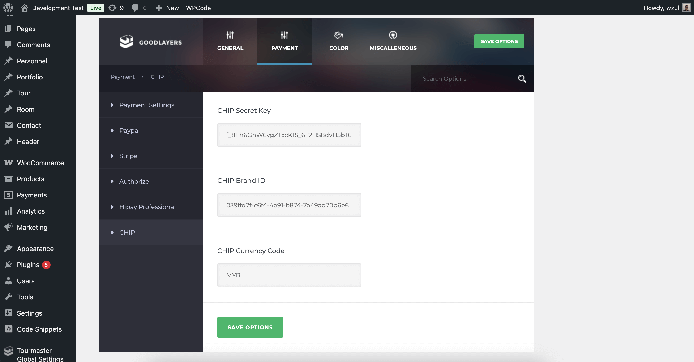

# CHIP for Tour Master

This module adds CHIP payment method option to your [Tour Master](https://codecanyon.net/item/tour-master-tour-booking-travel-wordpress-plugin/20539780) plugin.

## Installation

* [Download plugin zip file.](https://github.com/CHIPAsia/chip-for-tour-master/archive/refs/heads/main.zip)
* Log in to your Wordpress admin panel and go: **Plugins** -> **Add New**
* Select **Upload Plugin**, choose zip file you downloaded in step 1 and press **Install Now**
* Activate plugin

## Configuration

Set the **Brand ID** and **Secret Key** in the plugins settings.

For currency settings, set the value to **MYR**.

Additional configuration are required at the moment until Tour Master add action hooks and filters.

* Edit file: _wp-content/plugins/tourmaster/room/include/_***payment-element.php***
  * Add `in_array( 'chip', $payment_method )` in line:

  ```php
  } elseif ( in_array( 'paypal', $payment_method ) || in_array( 'credit-card', $payment_method ) || in_array( 'hipayprofessional', $payment_method ) ) {
  ```

  * Full line example as follows:

  ```php
  } elseif ( in_array( 'chip', $payment_method ) || in_array( 'paypal', $payment_method ) || in_array( 'credit-card', $payment_method ) || in_array( 'hipayprofessional',$payment_method ) ) {
  ```

  * Add `'chip' => esc_html__( 'CHIP', 'tourmaster' ),` in `$payment_titles` variable.

  * Full line example as follows:

  ```php
  $payments_title = array(
    'paypal'            => esc_html__( 'Paypal', 'tourmaster' ),
    'credit-card'       => esc_html__( 'Credit Card', 'tourmaster' ),
    'hipayprofessional' => esc_html__( 'Hipay Professional','tourmaster' ),
    'chip'              => esc_html__( 'CHIP', 'tourmaster' ),
  );
  ```

## Screenshot



## Other

Facebook: [Merchants & DEV Community](https://www.facebook.com/groups/3210496372558088)